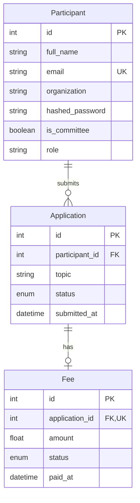

# Схема данных ConfManager

Три связанные сущности MVP хранятся в реляционной БД. Схема описана в `app/models.py`. SQLAlchemy создаёт отсутствующие таблицы при setup или старте приложения; уже существующие таблицы и записи сохраняются. Автоматическое изменение существующей схемы не выполняется.

| Сущность | Ограничения и значения |
| --- | --- |
| Participant | Уникальный email, обязательные ФИО и хеш пароля; организация необязательна; регистрация не выдаёт права оргкомитета |
| Application | Существующий участник, непустая тема; начальный статус new, далее under_review/accepted/rejected |
| Fee | Существующая заявка, одна запись на заявку; начальный статус unpaid, после оплаты paid и paid_at |

`is_committee` является источником прав. Поле role сохранено для совместимости исходной БД; API вычисляет роль committee/participant из is_committee, поэтому рассогласование старого текстового поля не повышает права.

В SQLite включены внешние ключи. В PostgreSQL операции статуса и оплаты блокируют заявку, затем взнос, в едином порядке. SQLite подходит для локальной демонстрации; параллельную нагрузку PostgreSQL нужно проверить при развёртывании ЛР2.

Время хранится как UTC без смещения для совместимости исходной схемы. Сумма пока хранится как Float, но API запрещает нечисловые, отрицательные суммы и более двух десятичных знаков. Переход на Numeric/Decimal и ограничения уровня БД должны выполняться версионированной миграцией в ЛР3. Прямое изменение БД обходит проверки API.

Удаление участников, заявок и взносов не входит в операции ЛР1. Приглашения, тезисы и гостиничные заявки пока не имеют таблиц.
